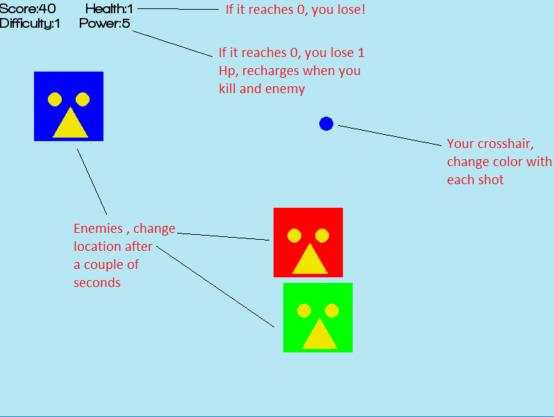

# Quick-Shooter
A shooting game where the player need to apply color tracking and quick reflexes to quickly hit the enemies appearing on the screen, each enemy has a specific color and the player crosshair change its color randomly with each shot, as you kill more enemies the game gets harder and faster.

Your goal is to survive the attack as long as you can (you start with 3 hp points).

## Ways to lose HP:-
- Shooting an enemy with the different crosshair color.
- Missing  a shot
- If lots of enemies disappear without you killing any of them you lose power, if your power reaches 0 you lose an HP point and the power regenerates to 5 points.

## Power ups:-
There are 3 types of power ups each with a different color, like the enemies you have to shoot them with a right color to get the bonus, if you miss or shoot with a different color you lose hp , since they are much smaller than the enemies shooting them can be a little tricky but still very rewarding.

- Red power up: yields 1 Health point.
- Green power up: yields 5 power points.
- Blue power up: yields a large score bonus.

    

